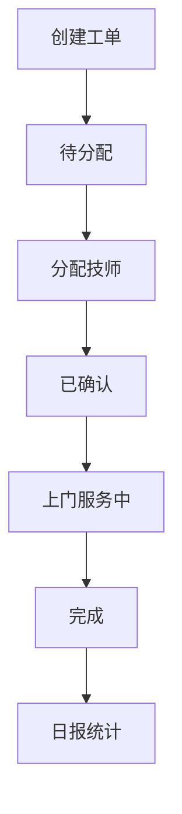
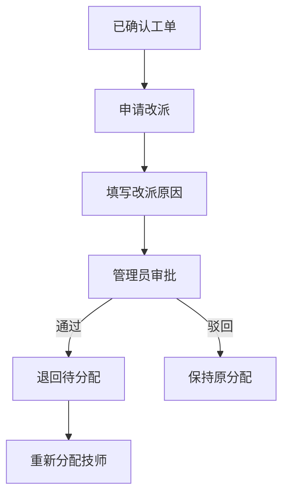
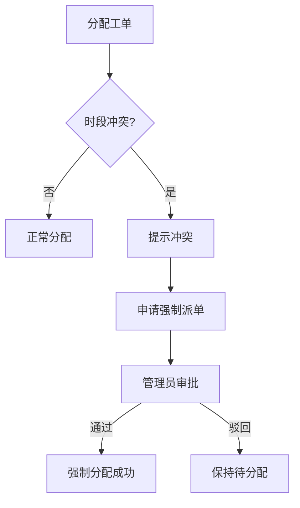

## 1. 产品概述

本地上门工单调度系统，用于管理技师班表、工单分配与状态流转。系统支持从工单创建到分配、确认上门、完成处理的全流程管理，并提供冲突检测、审批流程和历史追溯能力。

- **核心价值**：解决上门服务调度混乱、冲突频发、责任不清的问题
- **目标用户**：调度管理员、普通调度员、运维主管
- **部署方式**：本地部署，数据持久化存储

## 2. 核心功能

### 2.1 用户角色

| 角色 | 登录方式 | 核心权限 |
|------|----------|----------|
| 管理员 | 账号登录 | 全部功能，包括批准加班、强制派单、审批改派 |
| 普通调度员 | 账号登录 | 创建工单、分配工单、确认工单、查看历史，不能批准加班和强制派单 |

### 2.2 功能模块

1. **技师班表管理**：技师信息维护、班表设置、可服务时段配置
2. **工单管理**：工单创建、待分配、已确认、改派、强制派单、完成、取消
3. **审批中心**：加班审批、强制派单审批、改派审批
4. **冲突检测**：时段重叠检测、时间有效性验证
5. **历史追溯**：改派原因、审批意见、冲突处理记录
6. **日报导出**：按日期导出工单处理日报

### 2.3 页面详情

| 页面名称 | 模块名称 | 功能描述 |
|----------|----------|----------|
| 登录页 | 登录表单 | 账号密码登录，角色区分 |
| 工作台 | 数据概览 | 今日工单统计、待办事项、冲突预警 |
| 技师班表 | 技师列表 | 技师信息增删改查 |
| 技师班表 | 班表日历 | 按周/月查看技师班表，设置可服务时段 |
| 工单列表 | 工单列表 | 按状态筛选，搜索，分页 |
| 工单详情 | 工单信息 | 工单基本信息、状态时间线、操作记录 |
| 工单创建 | 创建表单 | 客户信息、服务类型、预约时段、备注 |
| 审批中心 | 审批列表 | 待审批、已审批列表，审批操作 |
| 日报导出 | 日报页面 | 选择日期，查看日报，导出 CSV |

## 3. 核心流程

### 3.1 主流程（正常链路）

调度员创建工单 → 工单进入待分配状态 → 分配给合适技师 → 技师确认（或调度员确认）→ 技师上门服务 → 完成工单 → 系统记录完成时间 → 日报统计

### 3.2 改派流程

工单已确认 → 申请改派 → 填写改派原因 → 管理员审批 → 重新分配 → 新技师确认

### 3.3 强制派单流程

调度员尝试分配冲突时段工单 → 提示冲突 → 申请强制派单 → 填写理由 → 管理员审批 → 审批通过后强制分配

## 4. 用户界面设计

### 4.1 设计风格

- **主色调**：深蓝 (#1e3a5f) 作为主色，传达专业可信赖感
- **辅助色**：橙红 (#e74c3c) 用于警告和冲突，绿色 (#27ae60) 用于成功状态
- **中性色**：深灰至浅灰的渐变，确保信息层次清晰
- **按钮风格**：微圆角 (4px)，悬停时有微妙的阴影和颜色变化
- **字体**：系统无衬线字体，标题加粗，正文常规
- **布局风格**：顶部导航 + 侧边栏 + 主内容区的经典后台布局
- **图标风格**：线性图标，简洁现代

### 4.2 页面设计概述

| 页面名称 | 模块名称 | UI 元素 |
|----------|----------|----------|
| 登录页 | 登录卡片 | 居中卡片布局，深色背景，品牌标识，输入框，登录按钮 |
| 工作台 | 数据概览 | 数据卡片网格，趋势图表，待办列表，冲突预警 |
| 技师班表 | 班表日历 | 周视图日历，时间轴网格，技师列，拖拽调整 |
| 工单列表 | 工单表格 | 状态标签，筛选栏，搜索框，操作列 |
| 工单详情 | 详情页 | 左右两栏布局，左侧工单信息，右侧时间线和操作 |
| 审批中心 | 审批列表 | 标签页切换，审批卡片，操作按钮 |
| 日报导出 | 日报页面 | 日期选择器，数据表格，导出按钮 |

### 4.3 响应式

- 桌面端优先设计 (1440px)
- 平板端 (768px) 侧边栏可折叠
- 移动端 (375px) 底部导航，单列布局

## 5. 业务规则与约束

### 5.1 时间规则
- 结束时间必须晚于开始时间，否则工单不能保存
- 同一技师在重叠时段不能确认两张工单
- 班表时间外的工单视为加班，需要审批

### 5.2 权限规则
- 普通角色不能批准加班
- 普通角色不能执行强制派单
- 只有管理员可以审批改派申请

### 5.3 数据持久化
- 所有数据存储在本地 SQLite 数据库中
- 应用重启后，技师安排、未解决冲突、审批记录保持一致
- 导出的日报内容可重复生成，结果一致
