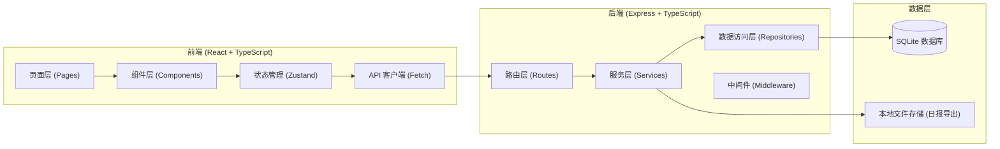
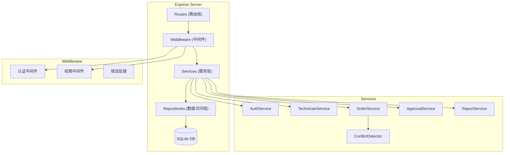
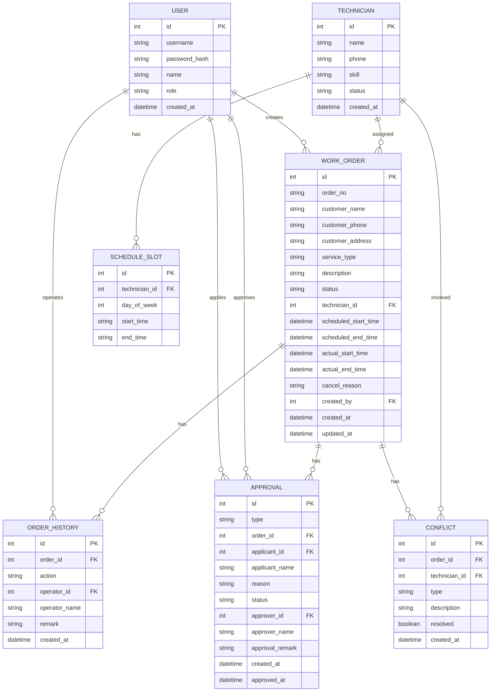

## 1. 架构设计



## 2. 技术描述

- **前端**：React@18 + TypeScript + Vite + Tailwind CSS@3 + Zustand + React Router DOM + Lucide React
- **后端**：Express@4 + TypeScript + better-sqlite3
- **数据库**：SQLite (better-sqlite3)，本地文件存储
- **认证**：基于 Session 的登录认证
- **初始化工具**：vite-init (react-express-ts 模板)

### 技术选型理由

1. **SQLite**：本地部署，无需额外数据库服务，数据持久化到文件，重启不丢失
2. **better-sqlite3**：同步 API，性能优秀，易于使用
3. **Zustand**：轻量级状态管理，简单直观
4. **Tailwind CSS**：快速构建高质量 UI，设计系统统一

## 3. 路由定义

### 前端路由

| 路由 | 页面 | 说明 |
|------|------|------|
| /login | 登录页 | 账号密码登录 |
| /dashboard | 工作台 | 数据概览、待办事项 |
| /technicians | 技师列表 | 技师信息管理 |
| /schedule | 技师班表 | 班表日历、可服务时段 |
| /orders | 工单列表 | 工单列表、筛选、搜索 |
| /orders/new | 创建工单 | 新建工单表单 |
| /orders/:id | 工单详情 | 工单详情、操作、历史 |
| /approvals | 审批中心 | 待审批、已审批列表 |
| /reports | 日报导出 | 日报查看、导出 |

### 后端 API 路由

| 方法 | 路径 | 功能 |
|------|------|------|
| POST | /api/auth/login | 用户登录 |
| POST | /api/auth/logout | 用户登出 |
| GET | /api/auth/me | 获取当前用户 |
| GET | /api/technicians | 获取技师列表 |
| POST | /api/technicians | 创建技师 |
| PUT | /api/technicians/:id | 更新技师 |
| DELETE | /api/technicians/:id | 删除技师 |
| GET | /api/technicians/:id/schedule | 获取技师班表 |
| PUT | /api/technicians/:id/schedule | 更新技师班表 |
| GET | /api/orders | 获取工单列表 |
| POST | /api/orders | 创建工单 |
| GET | /api/orders/:id | 获取工单详情 |
| PUT | /api/orders/:id/assign | 分配工单 |
| PUT | /api/orders/:id/confirm | 确认工单 |
| PUT | /api/orders/:id/reassign | 申请改派 |
| PUT | /api/orders/:id/force-assign | 强制派单申请 |
| PUT | /api/orders/:id/complete | 完成工单 |
| PUT | /api/orders/:id/cancel | 取消工单 |
| GET | /api/orders/:id/history | 获取工单历史 |
| GET | /api/approvals | 获取审批列表 |
| PUT | /api/approvals/:id/approve | 审批通过 |
| PUT | /api/approvals/:id/reject | 审批驳回 |
| GET | /api/reports/daily | 获取日报数据 |
| GET | /api/reports/daily/export | 导出日报 CSV |
| GET | /api/conflicts | 获取冲突列表 |

## 4. API 定义 (TypeScript 类型)

```typescript
// 用户
interface User {
  id: number;
  username: string;
  role: 'admin' | 'dispatcher';
  name: string;
}

// 技师
interface Technician {
  id: number;
  name: string;
  phone: string;
  skill: string;
  status: 'active' | 'inactive';
  createdAt: string;
}

// 班表时段
interface ScheduleSlot {
  id: number;
  technicianId: number;
  dayOfWeek: number; // 0-6, 0=周日
  startTime: string; // HH:mm
  endTime: string; // HH:mm
}

// 工单
interface WorkOrder {
  id: number;
  orderNo: string;
  customerName: string;
  customerPhone: string;
  customerAddress: string;
  serviceType: string;
  description: string;
  status: 'pending' | 'assigned' | 'confirmed' | 'in_progress' | 'completed' | 'cancelled';
  technicianId: number | null;
  scheduledStartTime: string;
  scheduledEndTime: string;
  actualStartTime: string | null;
  actualEndTime: string | null;
  cancelReason: string | null;
  createdBy: number;
  createdAt: string;
  updatedAt: string;
}

// 工单历史
interface OrderHistory {
  id: number;
  orderId: number;
  action: string;
  operatorId: number;
  operatorName: string;
  remark: string | null;
  createdAt: string;
}

// 审批
interface Approval {
  id: number;
  type: 'reassign' | 'force_assign' | 'overtime';
  orderId: number;
  applicantId: number;
  applicantName: string;
  reason: string;
  status: 'pending' | 'approved' | 'rejected';
  approverId: number | null;
  approverName: string | null;
  approvalRemark: string | null;
  createdAt: string;
  approvedAt: string | null;
}

// 冲突
interface Conflict {
  id: number;
  orderId: number;
  technicianId: number;
  type: 'time_overlap' | 'overtime';
  description: string;
  resolved: boolean;
  createdAt: string;
}

// 日报
interface DailyReport {
  date: string;
  totalOrders: number;
  completedOrders: number;
  cancelledOrders: number;
  pendingOrders: number;
  technicianStats: {
    technicianId: number;
    technicianName: string;
    completedCount: number;
    totalWorkHours: number;
  }[];
}
```

## 5. 服务器架构图



## 6. 数据模型

### 6.1 ER 图



### 6.2 DDL 语句

```sql
-- 用户表
CREATE TABLE users (
  id INTEGER PRIMARY KEY AUTOINCREMENT,
  username TEXT UNIQUE NOT NULL,
  password_hash TEXT NOT NULL,
  name TEXT NOT NULL,
  role TEXT NOT NULL CHECK(role IN ('admin', 'dispatcher')),
  created_at DATETIME DEFAULT CURRENT_TIMESTAMP
);

-- 技师表
CREATE TABLE technicians (
  id INTEGER PRIMARY KEY AUTOINCREMENT,
  name TEXT NOT NULL,
  phone TEXT,
  skill TEXT,
  status TEXT NOT NULL DEFAULT 'active' CHECK(status IN ('active', 'inactive')),
  created_at DATETIME DEFAULT CURRENT_TIMESTAMP
);

-- 班表时段表
CREATE TABLE schedule_slots (
  id INTEGER PRIMARY KEY AUTOINCREMENT,
  technician_id INTEGER NOT NULL,
  day_of_week INTEGER NOT NULL CHECK(day_of_week BETWEEN 0 AND 6),
  start_time TEXT NOT NULL,
  end_time TEXT NOT NULL,
  FOREIGN KEY (technician_id) REFERENCES technicians(id) ON DELETE CASCADE
);

-- 工单表
CREATE TABLE work_orders (
  id INTEGER PRIMARY KEY AUTOINCREMENT,
  order_no TEXT UNIQUE NOT NULL,
  customer_name TEXT NOT NULL,
  customer_phone TEXT,
  customer_address TEXT,
  service_type TEXT NOT NULL,
  description TEXT,
  status TEXT NOT NULL DEFAULT 'pending' CHECK(status IN ('pending', 'assigned', 'confirmed', 'in_progress', 'completed', 'cancelled')),
  technician_id INTEGER,
  scheduled_start_time DATETIME NOT NULL,
  scheduled_end_time DATETIME NOT NULL,
  actual_start_time DATETIME,
  actual_end_time DATETIME,
  cancel_reason TEXT,
  created_by INTEGER NOT NULL,
  created_at DATETIME DEFAULT CURRENT_TIMESTAMP,
  updated_at DATETIME DEFAULT CURRENT_TIMESTAMP,
  FOREIGN KEY (technician_id) REFERENCES technicians(id),
  FOREIGN KEY (created_by) REFERENCES users(id)
);

-- 工单历史表
CREATE TABLE order_histories (
  id INTEGER PRIMARY KEY AUTOINCREMENT,
  order_id INTEGER NOT NULL,
  action TEXT NOT NULL,
  operator_id INTEGER NOT NULL,
  operator_name TEXT NOT NULL,
  remark TEXT,
  created_at DATETIME DEFAULT CURRENT_TIMESTAMP,
  FOREIGN KEY (order_id) REFERENCES work_orders(id) ON DELETE CASCADE,
  FOREIGN KEY (operator_id) REFERENCES users(id)
);

-- 审批表
CREATE TABLE approvals (
  id INTEGER PRIMARY KEY AUTOINCREMENT,
  type TEXT NOT NULL CHECK(type IN ('reassign', 'force_assign', 'overtime')),
  order_id INTEGER NOT NULL,
  applicant_id INTEGER NOT NULL,
  applicant_name TEXT NOT NULL,
  reason TEXT NOT NULL,
  status TEXT NOT NULL DEFAULT 'pending' CHECK(status IN ('pending', 'approved', 'rejected')),
  approver_id INTEGER,
  approver_name TEXT,
  approval_remark TEXT,
  created_at DATETIME DEFAULT CURRENT_TIMESTAMP,
  approved_at DATETIME,
  FOREIGN KEY (order_id) REFERENCES work_orders(id) ON DELETE CASCADE,
  FOREIGN KEY (applicant_id) REFERENCES users(id),
  FOREIGN KEY (approver_id) REFERENCES users(id)
);

-- 冲突表
CREATE TABLE conflicts (
  id INTEGER PRIMARY KEY AUTOINCREMENT,
  order_id INTEGER NOT NULL,
  technician_id INTEGER NOT NULL,
  type TEXT NOT NULL CHECK(type IN ('time_overlap', 'overtime')),
  description TEXT NOT NULL,
  resolved INTEGER NOT NULL DEFAULT 0,
  created_at DATETIME DEFAULT CURRENT_TIMESTAMP,
  FOREIGN KEY (order_id) REFERENCES work_orders(id) ON DELETE CASCADE,
  FOREIGN KEY (technician_id) REFERENCES technicians(id)
);

-- 索引
CREATE INDEX idx_orders_status ON work_orders(status);
CREATE INDEX idx_orders_technician ON work_orders(technician_id);
CREATE INDEX idx_orders_scheduled ON work_orders(scheduled_start_time);
CREATE INDEX idx_histories_order ON order_histories(order_id);
CREATE INDEX idx_approvals_status ON approvals(status);
CREATE INDEX idx_conflicts_resolved ON conflicts(resolved);
```

### 6.3 初始化数据

```sql
-- 初始用户 (密码都是 123456)
INSERT INTO users (username, password_hash, name, role) VALUES
('admin', '$2b$10$...', '系统管理员', 'admin'),
('dispatcher', '$2b$10$...', '张调度', 'dispatcher');

-- 初始技师
INSERT INTO technicians (name, phone, skill, status) VALUES
('李师傅', '13800138001', '空调维修', 'active'),
('王师傅', '13800138002', '水电维修', 'active'),
('赵师傅', '13800138003', '家电维修', 'active');

-- 初始班表 (周一到周五 9:00-18:00)
INSERT INTO schedule_slots (technician_id, day_of_week, start_time, end_time) VALUES
(1, 1, '09:00', '18:00'),
(1, 2, '09:00', '18:00'),
(1, 3, '09:00', '18:00'),
(1, 4, '09:00', '18:00'),
(1, 5, '09:00', '18:00'),
(2, 1, '09:00', '18:00'),
(2, 2, '09:00', '18:00'),
(2, 3, '09:00', '18:00'),
(2, 4, '09:00', '18:00'),
(2, 5, '09:00', '18:00'),
(3, 1, '09:00', '18:00'),
(3, 2, '09:00', '18:00'),
(3, 3, '09:00', '18:00'),
(3, 4, '09:00', '18:00'),
(3, 5, '09:00', '18:00');
```
